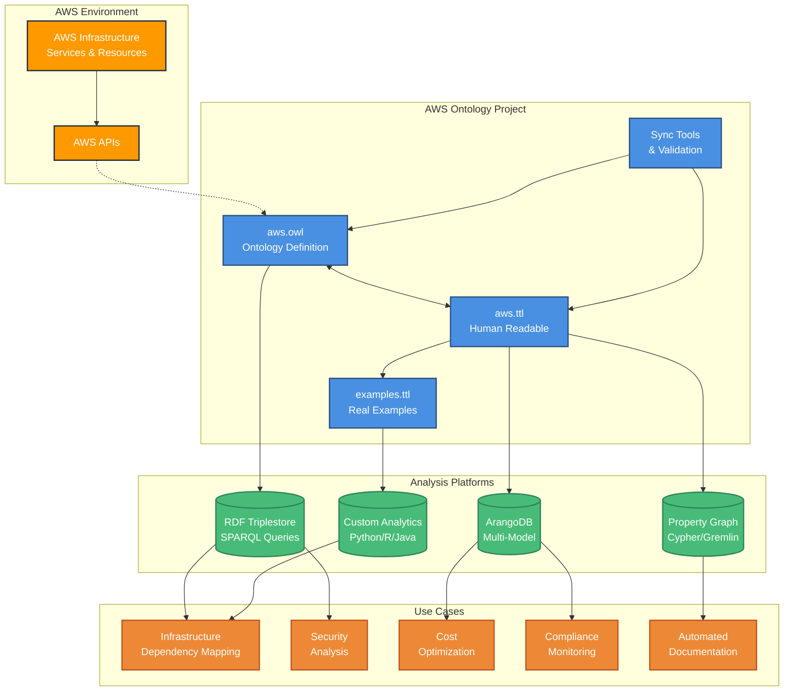

# AWS Ontology

A comprehensive semantic ontology for Amazon Web Services (AWS) resources and their relationships. This project provides a formal OWL ontology that models AWS infrastructure, services, and their complex interdependencies for advanced analysis, compliance monitoring, and automation. The AWS ontology can be used to bootstrap AWS graph projects for infrastructure mapping, security analysis, and cost optimization on graph databases that can ingest ontologies.  These include RDF databases that work natively with ontologies and property graph databases with RDF adapters, for example, it can be used with the [ArangoDB semantic layer integration](docs/ARANGODB_INTEGRATION.md) to generate flexible physical graph models (LPG, Property Graphs, RDF).

## 🎯 Overview

The AWS Ontology is a production-ready semantic web resource that:

- **Models 88 AWS resource types** across compute, storage, networking, containers, API services, and integration
- **Defines 196 relationships** including temporal, cost, and compliance associations
- **Provides comprehensive examples** with real-world AWS configurations
- **Supports multiple formats** (OWL/XML, Turtle, with format synchronization)
- **Includes semantic constraints** (cardinality, disjoint classes, property characteristics)
- **Offers testing framework** for quality assurance and validation

## 📊 Current Metrics

| Metric | Count | Recent Growth |
|--------|-------|---------------|
| **Total Triples** | 1,380 | +285 triples |
| **Classes** | 88 | +17 new AWS services |
| **Object Properties** | 98 | +5 new properties |
| **Data Properties** | 98 | +36 new properties |
| **Example Instances** | 535+ | +143 new examples |

## ⚡ Quick Example

Get started in 30 seconds - here's how to query AWS resources using SPARQL:

```sparql
# Find all S3 buckets and their encryption status
PREFIX aws: <http://www.semanticweb.org/aws-ontology#>
PREFIX rdfs: <http://www.w3.org/2000/01/rdf-schema#>

SELECT ?bucket ?label ?encrypted WHERE {
  ?bucket a aws:S3Bucket .
  ?bucket rdfs:label ?label .
  ?bucket aws:isEncrypted ?encrypted .
}
```

```python
# Python example using rdflib
from rdflib import Graph, Namespace

g = Graph()
g.parse("ontology/aws.ttl", format="turtle")
g.parse("ontology/examples.ttl", format="turtle")

# Execute SPARQL query
results = g.query("""
    PREFIX aws: <http://www.semanticweb.org/aws-ontology#>
    SELECT ?service ?depends_on WHERE {
        ?service aws:dependsOn ?depends_on .
    }
""")

for row in results:
    print(f"{row.service} depends on {row.depends_on}")
```

```javascript
// AQL example using ArangoDB Property Graph (PG)
// Find running EC2 instances and their VPCs with cost analysis
FOR instance IN ec2_instances
    FILTER instance.state == "running"
    
    FOR vpc IN 1..1 OUTBOUND instance belongs_to_vpc
        LET totalCost = SUM(
            FOR resource IN 1..3 OUTBOUND vpc contains, runs_in, uses
                RETURN resource.monthlyCost || 0
        )
        
        RETURN {
            instance: instance.instanceId,
            vpc: vpc.vpcId,
            instanceType: instance.instanceType,
            estimatedMonthlyCost: totalCost
        }
```

**What you get:** Immediate insight into your AWS infrastructure relationships, security posture, dependencies, and cost optimization opportunities through semantic queries across multiple database platforms.

## 🏗️ Ontology Structure

### Visual Overview

*AWS Ontology class hierarchy and relationships as viewed in Protégé*

### Architecture Overview

*How the AWS Ontology integrates into analysis workflows across different platforms and use cases*

### Core Service Categories
- **🔧 Container Services**: ECS, EKS, Fargate, ECR
- **🔗 API & Integration**: API Gateway, Step Functions, EventBridge, SNS, SQS
- **💻 Compute**: EC2, Lambda, Auto Scaling Groups
- **💾 Storage**: S3, EBS, EFS, RDS Clusters & Snapshots
- **🗄️ Database**: DynamoDB, DocumentDB, Redshift, RDS
- **🌐 Networking**: VPC, Security Groups, Load Balancers, Elastic IPs, NAT/Internet Gateways, VPC Endpoints
- **🔐 Identity & Access**: IAM Users, Roles, Policies, Instance Profiles
- **🔒 Security**: KMS Keys & Aliases, Secrets Manager, Network ACLs, Security Group Rules
- **🌍 Content Delivery**: CloudFront Distributions
- **📊 Monitoring**: CloudWatch, CloudTrail

### Advanced Relationship Types
- **⏰ Temporal**: `createdBefore`, `replacedBy`, `migratedFrom`
- **💰 Cost**: `incursChargeFor`, `optimizedBy`, `allocatesCostTo`
- **🛡️ Compliance**: `compliesWith`, `auditedBy`, `controlledBy`

## 💡 Why Use the AWS Ontology?

The AWS Ontology provides a structured, semantic foundation for understanding and analyzing AWS infrastructure relationships. Here's why it's valuable:

### 🎯 **Project Development Benefits**
The structured semantic relationships in the ontology support various AWS infrastructure analysis projects:

- **🏗️ Infrastructure Dependency Mapping**: Visualize and analyze complex resource relationships across your AWS environment
- **🔍 Impact Analysis**: Understand cascading effects of changes before implementation
- **🛡️ Security Policy Validation**: Ensure compliance and identify security gaps through relationship analysis
- **💰 Cost Optimization**: Discover resource relationships that drive costs and optimization opportunities
- **🏢 Multi-Account Governance**: Track and manage resources across organizational boundaries
- **📋 Automated Documentation**: Generate up-to-date architecture diagrams and dependency maps
- **🔧 Resource Discovery**: Find orphaned resources and understand their connections

### 🔄 **Graph Database Integration**
The ontology can be imported into graph databases for enhanced querying and analysis capabilities. For example, the ArangoDB integration using ArangoRDF supports multiple physical graph models:
- **Labeled Property Graphs (LPG)**: Industry-standard format for maximum compatibility
- **ArangoDB-native Property Graphs**: Optimized for performance and native capabilities
- **RDF Graph Schemas**: Maintain semantic web standards while leveraging multi-model features

This approach allows you to choose the most appropriate representation for your specific analysis requirements.

## 🚀 Quick Start

### Prerequisites
- Python 3.8+
- RDF processing tools (rdflib)
- Optional: Protégé for visual exploration
- Optional: ArangoDB for graph database integration

### Installation

```bash
# Clone the repository
git clone https://github.com/YOUR_USERNAME/AWS_Ontology.git
cd AWS_Ontology

# Set up virtual environment (recommended)
python3 -m venv venv
source venv/bin/activate

# Install dependencies
pip install -r requirements.txt

# Verify ontology integrity
python tools/sync_formats.py check

# Run quality tests
python -m unittest tests.test_ontology_quality -v
```

## 📁 Repository Structure

```
AWS_Ontology/
├── ontology/
│   ├── aws.owl           # Main ontology (OWL/XML format)
│   ├── aws.ttl           # Turtle format (human-readable)
│   └── examples.ttl      # Real-world example instances
├── docs/
│   ├── PRD.md           # Product Requirements Document
│   ├── PROTEGE_GUIDE.md # Protégé exploration guide
│   ├── SPARQL_EXAMPLES.md # 22 ready-to-use SPARQL queries
│   └── USAGE_GUIDE.md   # Comprehensive usage documentation
├── tests/               # Comprehensive test suite
├── tools/               # Format synchronization utilities
└── automation/         # AWS change monitoring tools
```

## 🔍 Protégé Integration

Open the ontology in Protégé for visual exploration:

```bash
# Method 1: Direct open
open ontology/aws.owl

# Method 2: Manual open in Protégé
# File → Open → ontology/aws.owl
```

**Key Protégé Features:**
- **Class Hierarchy**: Browse 71 AWS resource classes
- **Object Properties**: Explore 93 relationship types
- **Reasoning**: Validate with HermiT reasoner
- **OntoGraf**: Visualize relationships graphically
- **SPARQL**: Test queries from our examples

See [`docs/PROTEGE_GUIDE.md`](docs/PROTEGE_GUIDE.md) for detailed exploration instructions.

## 🧪 SPARQL Querying

The ontology supports rich SPARQL queries for analysis:

```sparql
# Find all container services
PREFIX : <http://www.semanticweb.org/aws-ontology#>
SELECT ?service ?label WHERE {
  ?service rdfs:subClassOf* :ComputeResource .
  ?service rdfs:label ?label .
  FILTER(CONTAINS(?label, "ECS") || CONTAINS(?label, "EKS"))
}

# Find services that can trigger Step Functions
SELECT ?service ?stepFunction WHERE {
  ?service :triggersStepFunction ?stepFunction
}
```

See [`docs/SPARQL_EXAMPLES.md`](docs/SPARQL_EXAMPLES.md) for 22 ready-to-use queries.

## 🔧 Tools & Utilities

### Format Synchronization
```bash
# Check OWL ↔ TTL synchronization
python tools/sync_formats.py check

# Convert OWL to TTL
python tools/sync_formats.py owl-to-ttl

# Convert TTL to OWL
python tools/sync_formats.py ttl-to-owl
```

### Quality Assurance
```bash
# Run all quality tests
make test

# Test specific aspects
python -m unittest tests.test_ontology_quality -v
python -m unittest tests.test_examples_validation -v
python -m unittest tests.test_format_sync -v
```

### AWS Change Monitoring
```bash
# Monitor AWS service changes
python tools/monitor_aws_changes.py

# Schedule automated monitoring
make schedule-setup
```

## 🎯 Use Cases

### 1. Infrastructure Analysis
- Model complex AWS architectures
- Analyze service dependencies
- Identify optimization opportunities

### 2. Compliance Monitoring
- Track compliance status across resources
- Audit relationships and governance
- Monitor policy adherence

### 3. Cost Optimization
- Analyze cost allocation relationships
- Identify shared resources
- Model optimization scenarios

### 4. Security Analysis
- Map IAM relationships and permissions
- Analyze access patterns
- Identify security risks

### 5. Migration Planning
- Model current and target states
- Track migration relationships
- Plan temporal sequences

## 🧪 Testing Framework

Comprehensive testing ensures ontology quality:

- **Format Synchronization**: OWL ↔ TTL consistency
- **Ontology Quality**: Class/property validation
- **Example Validation**: Instance integrity
- **Performance**: Loading and query benchmarks

```bash
# Run all tests
make test

# Test categories
make test-sync     # Format synchronization
make test-quality  # Ontology structure
make test-examples # Example validation
make test-performance # Performance benchmarks
```

## 📈 Development Workflow

### Adding New Services
1. Define classes in `ontology/aws.owl`
2. Add relationships and properties
3. Create examples in `ontology/examples.ttl`
4. Sync formats: `python tools/sync_formats.py sync`
5. Run tests: `make test`
6. Update documentation

### Contributing
1. Fork the repository
2. Create feature branch
3. Add ontology enhancements
4. Include comprehensive tests
5. Update documentation
6. Submit pull request

## 🔗 Integration

### Graph Database Integration
The ontology supports multiple graph database representations:
- **RDF Triplestores**: Direct loading as RDF/OWL with full semantic reasoning support
- **ArangoDB**: Multi-model database integration using ArangoRDF for graph analytics and AQL queries
- **Labeled Property Graphs (LPG)**: Transform to property graph format with labeled nodes and edges for modern graph databases
- **Property Graphs (PG)**: Convert to property graph structures optimized for performance and graph analytics
- **Custom Transformations**: Flexible transformation patterns for domain-specific use cases and requirements

#### ArangoDB Integration
```bash
# Import AWS ontology into ArangoDB
python tools/import_to_arangodb.py

# Query with AQL
from arango import ArangoClient
client = ArangoClient(hosts='http://localhost:8529')
db = client.db('aws_ontology', username='root', password=os.getenv('ARANGO_PASSWORD', 'your_password'))
```

### Analysis Tools
- **Python**: rdflib, owlready2, networkx
- **Java**: Apache Jena, RDF4J, OWL API, JGraphT
- **JavaScript**: rdflib.js, cytoscape.js
- **R**: rdflib for R, igraph
- **SPARQL**: Standard RDF query language support

## 📚 Documentation

- [Usage Guide](docs/USAGE_GUIDE.md) - Comprehensive usage instructions
- [SPARQL Examples](docs/SPARQL_EXAMPLES.md) - Query examples and patterns
- [ArangoDB Integration](docs/ARANGODB_INTEGRATION.md) - Graph database setup and usage
- [Environment Variables](docs/ENVIRONMENT_VARIABLES.md) - Configuration and deployment settings
- [Protégé Guide](docs/PROTEGE_GUIDE.md) - Visual ontology exploration
- [Maintenance Strategy](docs/MAINTENANCE_STRATEGY.md) - Long-term maintenance approach

## 🤝 Community

### Questions & Support
- Create GitHub issues for questions
- Check existing documentation first
- Provide minimal reproduction examples

### Feature Requests
- Submit detailed GitHub issues
- Explain use case and benefits
- Consider contributing implementation

## 📄 License

This project is licensed under the MIT License - see the [LICENSE](LICENSE) file for details.

## 🔄 Version History

See [CHANGELOG.md](CHANGELOG.md) for detailed version history.

### Latest Enhancements (v0.4.0)
- ✅ Missing AWS Services (17 new classes: AutoScaling, EFS, DynamoDB, DocumentDB, Redshift, etc.)
- ✅ Enhanced Storage & Database Coverage (EFS, RDS Clusters, DynamoDB, DocumentDB, Redshift)
- ✅ Complete Networking Support (Elastic IPs, Target Groups, Network Interfaces, ACLs, VPC Endpoints)
- ✅ Security Services (KMS Keys & Aliases, Secrets Manager, Security Group Rules)
- ✅ Content Delivery (CloudFront Distributions)
- ✅ 143+ New Example Instances with realistic AWS configurations

---

**Note**: This is the core open-source AWS Ontology designed for flexible integration with various graph databases and analytics platforms through standard RDF/OWL interfaces and custom transformation patterns.