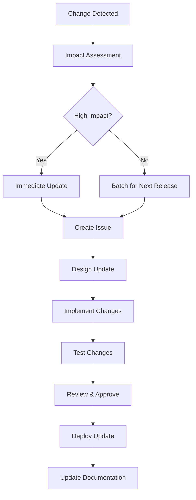

# AWS Ontology Maintenance Strategy

This document outlines strategies and processes for keeping the AWS Ontology synchronized with AWS service evolution, new features, and changes.

## 1. Change Detection Sources

### 1.1 AWS Official Sources
- **AWS What's New**: Primary source for new services and features
  - RSS Feed: `https://aws.amazon.com/new/feed/`
  - Website: `https://aws.amazon.com/new/`
- **AWS Documentation Updates**: Service-specific documentation changes
- **AWS API Reference Changes**: New APIs, parameters, and relationships
- **AWS CloudFormation Resource Types**: New resource types indicate new services/features
- **AWS Well-Architected Framework**: Architectural pattern updates

### 1.2 Community Sources
- **AWS Blog**: In-depth technical explanations
- **AWS re:Invent Sessions**: Annual conference announcements
- **AWS GitHub Repositories**: Open-source tool updates
- **AWS Developer Forums**: Community discussions on new features

### 1.3 Programmatic Monitoring
- **AWS CLI Updates**: New commands and options
- **AWS SDK Changes**: New service clients and methods
- **Terraform AWS Provider**: New resources and data sources
- **CDK Construct Library**: New construct patterns

## 2. Monitoring Strategy

### 2.1 Automated Monitoring
```bash
# Set up RSS feed monitoring
tools/monitor_aws_changes.py --feed aws-whats-new --frequency daily

# Monitor CloudFormation resource types
tools/monitor_aws_changes.py --source cloudformation --frequency weekly

# Track API changes
tools/monitor_aws_changes.py --source api-docs --services ec2,iam,s3 --frequency weekly
```

### 2.2 Manual Review Process
- **Monthly Review**: Systematic review of AWS What's New
- **Quarterly Deep Dive**: Comprehensive service documentation review
- **Annual Assessment**: Full ontology alignment with AWS architecture

### 2.3 Impact Assessment
For each detected change, evaluate:
1. **Relevance**: Does it affect services in our ontology scope?
2. **Impact Level**: New service, new feature, parameter change, deprecation
3. **Urgency**: Critical security/compliance vs. enhancement
4. **Effort**: Time required for ontology updates

## 3. Change Classification

### 3.1 High Priority Changes
- **New Core Services**: EC2, IAM, S3, VPC additions
- **Security/Compliance**: IAM policy changes, new security features
- **Architectural Patterns**: New service relationships
- **Deprecations**: Removal of services or features

### 3.2 Medium Priority Changes
- **Service Enhancements**: New parameters or options
- **Regional Availability**: Services in new regions
- **Performance Improvements**: Generally don't affect ontology
- **New Integrations**: Cross-service relationships

### 3.3 Low Priority Changes
- **UI/Console Changes**: Usually don't affect ontology
- **Pricing Changes**: Outside ontology scope
- **Documentation Updates**: May indicate minor clarifications

## 4. Update Process

### 4.1 Change Evaluation Workflow


### 4.2 Implementation Steps
1. **Create GitHub Issue**: Document the change and rationale
2. **Design Impact**: Identify affected classes, properties, examples
3. **Update Ontology**: Modify OWL/TTL files
4. **Update Examples**: Add/modify example instances
5. **Run Tests**: Ensure all quality tests pass
6. **Update Documentation**: README, PRD, comments
7. **Version Bump**: Increment ontology version
8. **Commit & Push**: Use descriptive commit messages

### 4.3 Version Management
```
Major.Minor.Patch (e.g., 1.2.3)

Major: Breaking changes, significant restructuring
Minor: New services, classes, or properties (backward compatible)
Patch: Bug fixes, clarifications, minor updates
```

## 5. Automation Tools

### 5.1 Change Detection Script
```python
# tools/monitor_aws_changes.py
# - Monitors AWS RSS feeds
# - Tracks CloudFormation resource types
# - Compares API documentation
# - Generates change reports
```

### 5.2 Update Assistant
```python
# tools/update_assistant.py
# - Suggests ontology changes based on AWS updates
# - Validates proposed changes against existing structure
# - Generates example instances for new services
```

### 5.3 Validation Pipeline
```python
# tools/validate_updates.py
# - Runs comprehensive test suite
# - Checks backward compatibility
# - Validates against AWS documentation
```

## 6. Maintenance Schedule

### 6.1 Regular Activities
- **Daily**: Monitor AWS What's New RSS feed
- **Weekly**: Review change queue, process low-impact updates
- **Monthly**: 
  - Review AWS blog posts and major announcements
  - Process medium-impact changes
  - Update examples with new best practices
- **Quarterly**: 
  - Deep dive review of all monitored services
  - Architectural review for new patterns
  - Comprehensive testing and validation
- **Annually**: 
  - Full ontology review and refactoring
  - Update maintenance tools
  - Review and update this strategy

### 6.2 Emergency Response
For critical security or compliance changes:
1. **Same Day**: Create issue and begin assessment
2. **Within 48 Hours**: Implement and test changes
3. **Within 1 Week**: Deploy update and notify users

## 7. Change Documentation

### 7.1 Change Log Format
```markdown
## [Version] - YYYY-MM-DD

### Added
- New service classes: ServiceX, ServiceY
- New properties: hasFeatureZ, supportsPatternW

### Changed
- Updated IAMPolicy to support new condition types
- Enhanced EC2Instance with new instance types

### Deprecated
- OldServiceClass (will be removed in v2.0.0)

### Removed
- UnsupportedFeature (deprecated in v1.5.0)

### Fixed
- Corrected domain/range for propertyABC
```

### 7.2 Migration Guides
For breaking changes, provide:
- What changed and why
- Migration steps for users
- Backward compatibility timeline
- Example transformations

## 8. Quality Assurance

### 8.1 Validation Checklist
- [ ] All new classes have proper documentation
- [ ] Properties have appropriate domains and ranges
- [ ] Examples demonstrate new features
- [ ] Tests pass for all changes
- [ ] Version updated appropriately
- [ ] CHANGELOG.md updated
- [ ] Breaking changes documented

### 8.2 Review Process
1. **Self-Review**: Implementer validates changes
2. **Peer Review**: Second team member reviews
3. **Testing**: Automated and manual testing
4. **Approval**: Final sign-off before deployment

## 9. Community Engagement

### 9.1 User Communication
- **GitHub Releases**: Detailed release notes
- **Issue Tracking**: Transparent change discussions
- **Documentation Updates**: Keep README current
- **Migration Assistance**: Help users adapt to changes

### 9.2 Feedback Collection
- **GitHub Issues**: Bug reports and feature requests
- **User Surveys**: Periodic feedback collection
- **Usage Analytics**: Understanding common use cases

## 10. Tool Integration

### 10.1 Development Tools
- **Pre-commit Hooks**: Automatic validation
- **CI/CD Pipeline**: Automated testing and deployment
- **Version Control**: Git flow for change management
- **Issue Tracking**: GitHub issues for change management

### 10.2 Monitoring Integration
- **Alerts**: Notification for high-priority changes
- **Dashboards**: Visual tracking of update status
- **Metrics**: Update frequency, test coverage, user adoption

## 11. Success Metrics

### 11.1 Timeliness
- **Critical Updates**: Within 48 hours of AWS announcement
- **Major Updates**: Within 2 weeks of AWS announcement
- **Minor Updates**: Within 1 month of AWS announcement

### 11.2 Quality
- **Test Coverage**: >95% for all new additions
- **Documentation**: 100% of new elements documented
- **User Satisfaction**: Measured through feedback

### 11.3 Completeness
- **Service Coverage**: Track percentage of in-scope AWS services
- **Feature Coverage**: Monitor completeness within covered services
- **Example Currency**: Examples reflect current AWS best practices

## 12. Risk Management

### 12.1 Identified Risks
- **AWS Rapid Change**: Services evolve faster than ontology updates
- **Breaking Changes**: AWS deprecations affect ontology structure
- **Resource Constraints**: Limited time for maintenance
- **Dependency Changes**: Third-party tools become unavailable

### 12.2 Mitigation Strategies
- **Automated Monitoring**: Reduce manual effort
- **Modular Design**: Isolate changes to specific areas
- **Version Control**: Enable rollback of problematic changes
- **Community Involvement**: Distribute maintenance effort

## 13. Future Enhancements

### 13.1 Planned Improvements
- **Machine Learning**: Automated change classification
- **API Integration**: Direct monitoring of AWS APIs
- **Semantic Versioning**: Automated version management
- **User Notifications**: Subscription-based update alerts

### 13.2 Research Areas
- **Natural Language Processing**: Automated documentation analysis
- **Graph Analysis**: Relationship pattern detection
- **Predictive Modeling**: Anticipate AWS service evolution
- **Collaborative Filtering**: Community-driven updates 